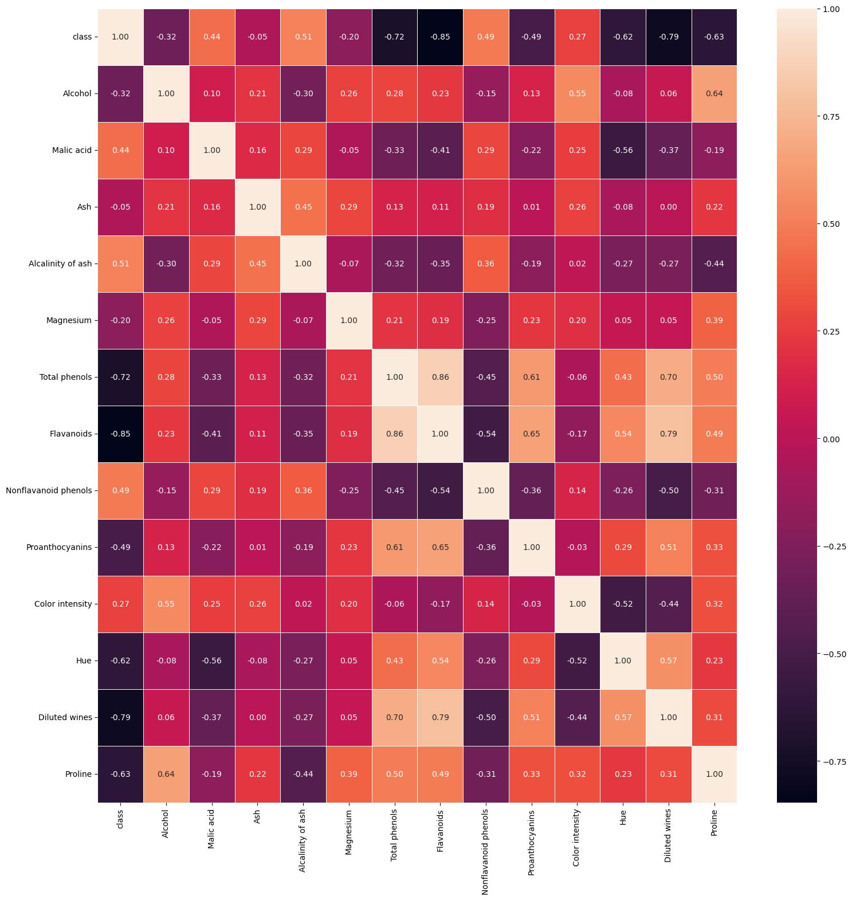
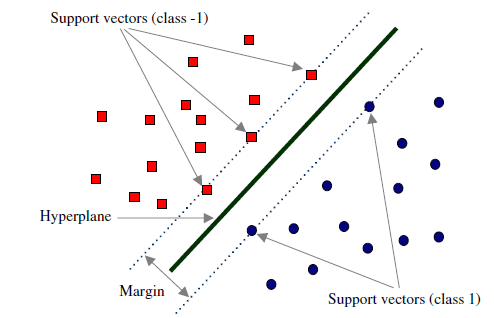
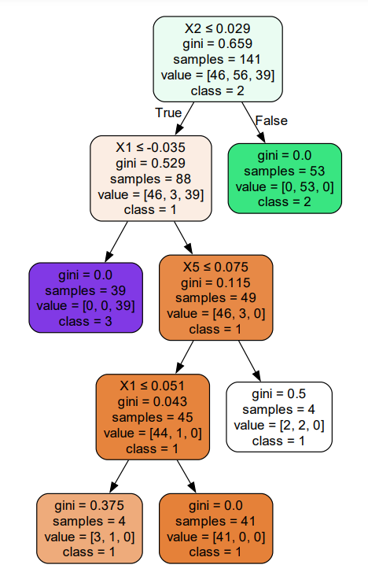
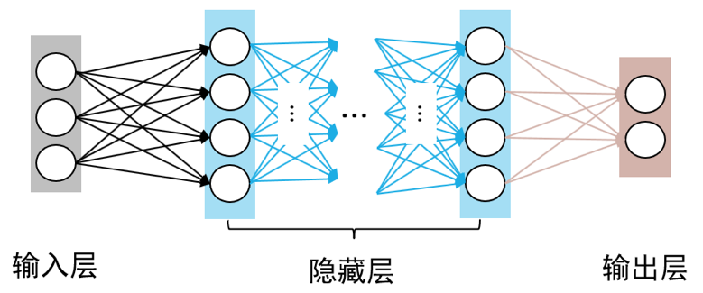
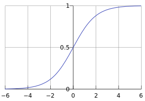
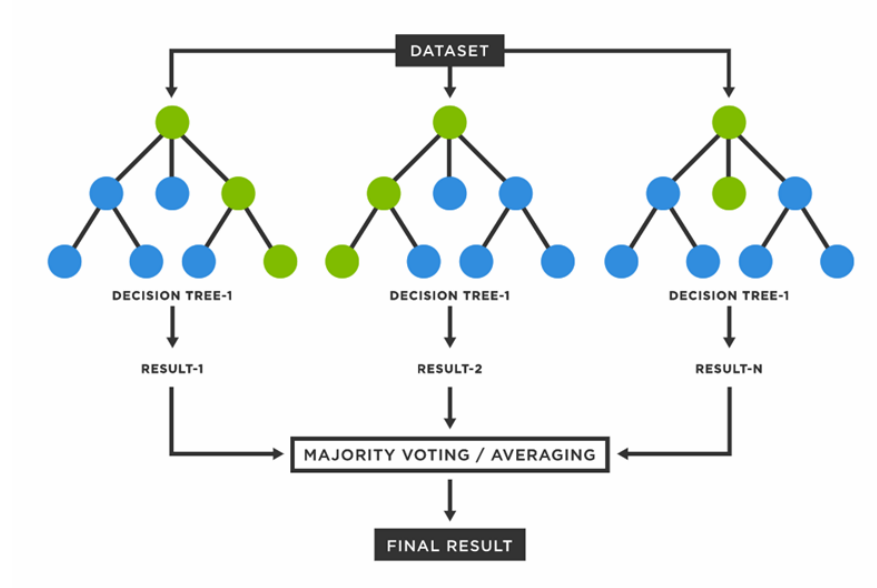
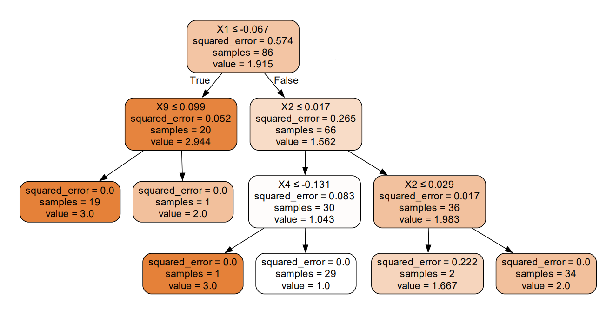
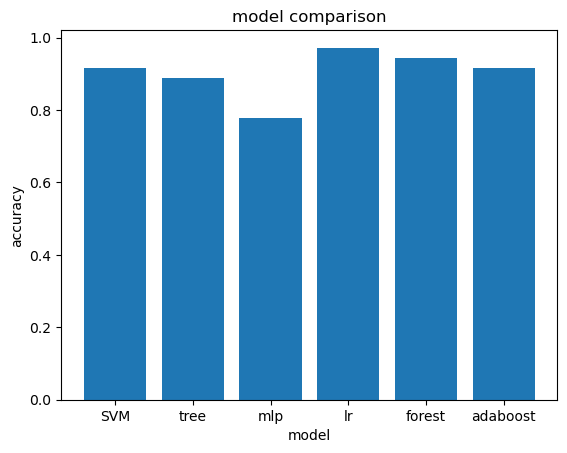

## **华东师范大学数据科学与工程学院实验报告** 

| **课程名称**：统计方法与机器学习 | **年级**：2022            | **实践成绩**：        |
| -------------------------------- | ------------------------- | --------------------- |
| **指导教师**：董启文             | **姓名**：郭夏辉          | **学号**：10211900416 |
| **上机实践编号**： Project1      | **上机实践时间**：2023.12 |                       |

## 实验目的

UCI数据集: http://archive.ics.uci.edu/ml/index.php  任选一个数据集，任选一种ML算法：逻辑回归、决策树、神经网络、SVM等。源码+实验报告 交给助教

Deadline: 学期末考试前

我选择的数据集：http://archive.ics.uci.edu/dataset/109/wine Using chemical analysis to determine the origin of wines

这是一个三分类问题，根据酒精、碱度等特征判断葡萄酒所属的类，同样这个问题可以转化为回归问题。在本次实验过程中，我使用了SVM、决策树、多层感知机、逻辑回归、随机森林、adaboost等方法.

## 实验过程

### 数据集初探

数据集的13个特征在官网的介绍中已经给出了，我只需要把它们去设置相应的列即可。载入数据及特征标签，查看数据的基本信息。

```python
Data = pd.read_csv("data/wine.data")
Data.columns = ["class", "Alcohol", "Malic acid", "Ash", "Alcalinity of ash", "Magnesium", "Total phenols", "Flavanoids", "Nonflavanoid phenols", "Proanthocyanins", "Color intensity", "Hue", "Diluted wines", "Proline"]
print(Data.info())
print(Data.head())

n = Data.shape[0]
p = Data.shape[1] - 1
print(f"数据集样本数量:{n},特征数量:{p}")
```

数据集样本数量:177,特征数量:13，这个数据集的规模还是十分小的。

```
count = dict(Data['class'].value_counts())
print(count)
```

结果是`{2: 71, 1: 58, 3: 48}` 可以看到这个三分类的任务还是相对来说比较均衡的。

接下来我就画出了各个特征的相关系数图：



通过上图，能看到有的特征之间相关程度较大，可能略大程度的多重共线性，所以我采用了PCA进行了降维，保证降维后保持95%的信息。

```python
X = Data.iloc[:,1:].values
X = StandardScaler().fit_transform(X)
pca = PCA(n_components=0.95) #保证降维后保持95%的信息
pca.fit(X)
X = pca.transform(X)
Y = Data['class']
print(X.shape)
```

输出结果是(177, 10)，说明降维之后特征维度下降到了10

### 数据集的处理

刚刚PCA降维之后从原本的13个特征变成了现在的10个特征，现在用留出法**来划分数据集为训练集和验证集**。其中80%用于训练，20%用于验证：

```python
seed = 666666
random.seed(seed)

data = np.column_stack((Data['class'], X))
Data = pd.DataFrame(data = data[0:,0:], columns=['Y','X1','X2','X3','X4','X5','X6','X7','X8','X9','X10'])

# 80%用于训练
n_train = int(n * 0.8)
n_test = n - n_train
index = range(0,n)
index_selected = random.sample(index,n_train)
index_selected.sort()


Data_train = Data.loc[index_selected]
Data_test = Data.drop(index = index_selected)
print(Data_train.head())
print(Data_test.head())
```

接下来，我要对自变量X进行标准化,并且对测试集和验证集进行一些小小的处理：

```python
X_train = Data_train.drop(columns = ['Y'],axis = 1)
Y_train = Data_train.Y

X_test = Data_test.drop(columns = ['Y'],axis=1)
Y_test = Data_test.Y

X_train_standardized = preprocessing.scale(X_train, with_mean = True, with_std=True) / np.sqrt(n_train)
X_test_standardized = preprocessing.scale(X_test, with_mean = True, with_std=True) / np.sqrt(n_test)

Y_train = Y_train.astype('int')
Y_test = Y_test.astype('int')
```

### 使用各模型进行分类

#### SVM



在机器学习中，支持向量机 （support vector machine，简称为SVM）是在分类与回归分析中分析数据的监督式学习模型与相关的学习算法。给定一组训练实例，每个训练实例被标记为属于两个类别中的一个或另一个，SVM训练算法建立一个将新的实例分配给两个类别之一的模型，使其成为非概率二元线性分类器。SVM模型是将实例表示为空间中的点，这样映射就使得单独类别的实例被尽可能宽的明显的间隔分开。然后，将新的实例映射到同一空间，并基于它们落在间隔的哪一侧来预测所属类别。

除了进行线性分类之外，SVM还可以使用所谓的核技巧有效地进行非线性分类，将其输入隐式映射到高维特征空间中，SVM找到的分割超平面具有更好的鲁棒性。支持向量机的主优化问题为凸优化问题，满足强对偶性，即主优化问题可以通过最大化对偶函数来求解。对偶函数是一个凹函数，因此最大化对偶函数是一个凸优化问题，可以通过多种凸优化方法来进行求解。

SVM比较重要的参数有函数类型 kernel、惩罚系数 C，我通过网格搜索得到了最优超参数组合：

```
best params: {'C': 100, 'kernel': 'linear'}
预测正确的数目为33,准确率:0.9166666666666666
              precision    recall  f1-score   support

           1       1.00      1.00      1.00        12
           2       1.00      0.80      0.89        15
           3       0.75      1.00      0.86         9

    accuracy                           0.92        36
   macro avg       0.92      0.93      0.92        36
weighted avg       0.94      0.92      0.92        36
```

由于数据量较少，可能出现过拟合，所以我在所有的数据上采用了五折交叉验证的方法又来验证了一下，结果如下所示：

```
五折交叉验证结果:[0.91666667 0.97222222 1.         1.         0.94285714]
```

可以看到模型预测效果较好。

#### 决策树

决策树是一种常见的监督学习算法，用于分类和回归问题。在分类问题中，叶子节点代表不同的类别，而在回归问题中，叶子节点包含数值预测。它模拟了决策过程，通过一系列规则和条件将数据点划分为不同的类别或值。决策树是一个层级结构，从根节点开始，通过一系列内部节点最终到达叶子节点。每个节点表示一个特征或属性上的测试条件，而每个边表示一个测试条件的结果。

在构建决策树时，算法选择最佳的特征和分裂条件，以将数据划分为不同的子集。这个选择通常基于信息增益、基尼不纯度、均方误差等评估指标。决策树的深度取决于数据和问题的复杂性。更深的树可以更好地拟合训练数据，但也容易过拟合。我设置的叶子节点最小样本数为4，预测正确率为0.888，还是可以接受的：

```
预测正确的数目为32,准确率:0.8888888888888888
              precision    recall  f1-score   support

           1       0.85      0.92      0.88        12
           2       0.92      0.80      0.86        15
           3       0.90      1.00      0.95         9

    accuracy                           0.89        36
   macro avg       0.89      0.91      0.89        36
weighted avg       0.89      0.89      0.89        36
```

五折交叉验证的结果如下所示,可以看到模型预测效果较好。

```
五折交叉验证结果:[0.97222222 0.91666667 0.91428571 0.94285714 0.91428571]
```

决策树的可视化如下所示：




#### 多层感知机



多层感知机（Multilayer Perceptron）又称为前向全连接神经网络（Feed-forward Fully-Connected Neural Network）是一种前向结构的人工神经网络，映射一组输入向量到一组输出向量。MLP可以被看作是一个有向图，由多个的节点层所组成，每一层都全连接到下一层。除了输入节点，每个节点都是一个带有非线性激活函数的神经元（或称处理单元）。反向传播算法是一种监督学习方法，常被用来训练MLP。多层感知器遵循人类神经系统原理，学习并进行数据预测。它首先学习，然后使用权重存储数据，并使用算法来调整权重并减少训练过程中的偏差，即实际值和预测值之间的误差。

多层感知的基本结构是三层：输入层，隐藏层和输出层，输入元素和权重的乘积被馈给具有神经元偏差的求和结点，使得MLP具备了快速解决复杂问题的优势。并且，MLP是感知器的推广，克服了感知器不能对线性不可分数据进行识别的弱点。

我将多层感知机模型的 L2 正则化参数设为 1e-5，隐藏层有 2 层，第一层有 6 个神经元，第二层有 2 个神经元。得到预测结果后计算MSE并将结果舍入为整数计算准确率。预测结果如下：

```
预测正确的数目为28,准确率:0.7777777777777778
              precision    recall  f1-score   support

           1       0.92      0.92      0.92        12
           2       0.89      0.53      0.67        15
           3       0.60      1.00      0.75         9

    accuracy                           0.78        36
   macro avg       0.80      0.82      0.78        36
weighted avg       0.83      0.78      0.77        36

```

模型准确率相比其他模型较低， 可能是由于 MLP 对于特征缩放比较敏感所致。

#### 逻辑回归



逻辑回归（逻辑斯谛斯谛回归，Logistic regression）是一种用于解决二分类（0 / 1）问题的机器学习方法，用于估计某种事物的可能性。Logistic回归是一种概率模型，其通过使用 Logistic 函数来将一个实数值映射到 [0, 1] 之间。Logistic 回归的本质是：假设数据服从这个分布，然后使用极大似然估计做参数的估计。Logistic 回归采用交叉熵作为损失函数，并使用梯度下降法来对参数进行优化。

逻辑回归预测准确率如下所示：

```
预测正确的数目为35,准确率:0.9722222222222222
              precision    recall  f1-score   support

           1       0.92      1.00      0.96        12
           2       1.00      0.93      0.97        15
           3       1.00      1.00      1.00         9

    accuracy                           0.97        36
   macro avg       0.97      0.98      0.98        36
weighted avg       0.97      0.97      0.97        36
```

五折交叉验证结果如下所示：

```
五折交叉验证结果:[0.97222222 0.97222222 1.         1.         1.        ]
```

可以看到，逻辑回归取得了十分优异的预测效果。

#### 随机森林



随机森林是一组决策树，但是决策树往往会创建规则，用来做出决策，而随机森林将随机选择要素并进行观测，构建决策森林，然后计算平均结果。与单个决策树相比，大量不相关的决策树会产生更准确的预测，这是因为大量的决策树协同工作，可以相互保护， 免受单个错误和过度拟合的影响。

这个实验中，我将随机森林模型训练的最大弱学习器个数设为 100（过小会欠拟合，过大收益较低且耗时长），内部节点再划分所需最小样本数设为5。

```
预测正确的数目为34,准确率:0.9444444444444444
              precision    recall  f1-score   support

           1       1.00      0.92      0.96        12
           2       0.93      0.93      0.93        15
           3       0.90      1.00      0.95         9

    accuracy                           0.94        36
   macro avg       0.94      0.95      0.95        36
weighted avg       0.95      0.94      0.94        36
```

随机森林的可视化如下所示：



#### adaboost

AdaBoost是一种机器学习方法，它的全名是自适应增强，这里的自适应在于：前一个分类器分错的样本会被用来训练下一个分类器，它对于噪声数据和异常数据很敏感，但在一些问题中，它不易出现过拟合现象。

AdaBoost方法是一种迭代算法，在每一轮中加入一个新的弱分类器，直到达到某个预定的足够小的错误率。每一个训练样本都被赋予一个权重，表明它被某个分类器选入训练集的概率。如果某个样本点已经被准确地分类，那么在构造下一个训练集中，它被选中的概率就被降低；相反，如果某个样本点没有被准确地分类，那么它的权重就得到提高。通过这样的方式，AdaBoost方法能“聚焦于”那些较难分（更富信息）的样本上。我使用 CART 决策树分类器，弱学习器的最大迭代次数为 100（过小容易欠拟合，过大容易过拟合），每个弱学习器的权重缩减系数设为 0.1。预测的结果如下所示：

```
预测正确的数目为33,准确率:0.9166666666666666
              precision    recall  f1-score   support

           1       0.92      0.92      0.92        12
           2       0.93      0.87      0.90        15
           3       0.90      1.00      0.95         9

    accuracy                           0.92        36
   macro avg       0.92      0.93      0.92        36
weighted avg       0.92      0.92      0.92        36
```

可以看到adaboost的效果还行，但也并没有想象中那么好。

## 对比与总结



可以看到本次实验我采用的6种模型中，逻辑回归的效果最好，但是多层感知机的效果最差。我推测自己多层感知机设置存在一些小小的问题，不过整体来说对于这个小样本的数据来说也取得了还能接受的正确率。

本次实验我先采用PCA对数据进行降维，有效缓解了原始数据特征存在的多重共线性，在此基础上对wine数据集进行了分类预测。虽然自己在几个模型上采用5折交叉验证的方法发现拟合情况还算可以接受，但不禁感叹这次自己选择的数据集还是太小了，很多工作并不能很好展开——比如参数搜索因为训练量实在是太小了，受数据的扰动很大，很容易出现一些看起来在验证集上正确性极高但是实际不合理论的错误最优参数。
