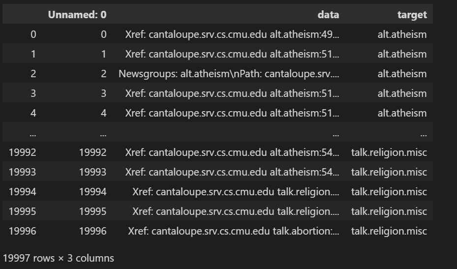
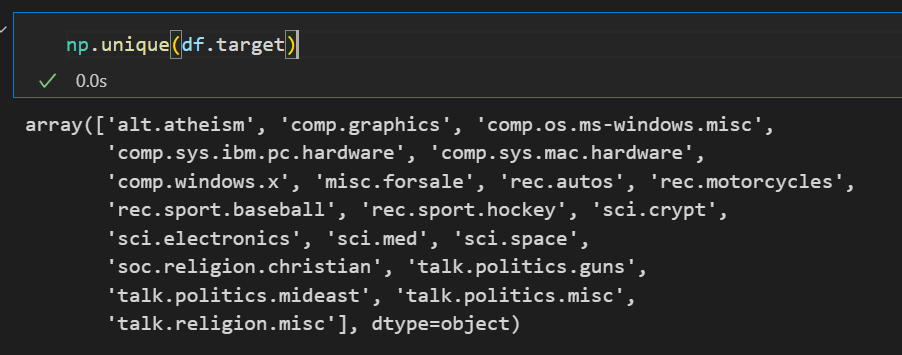
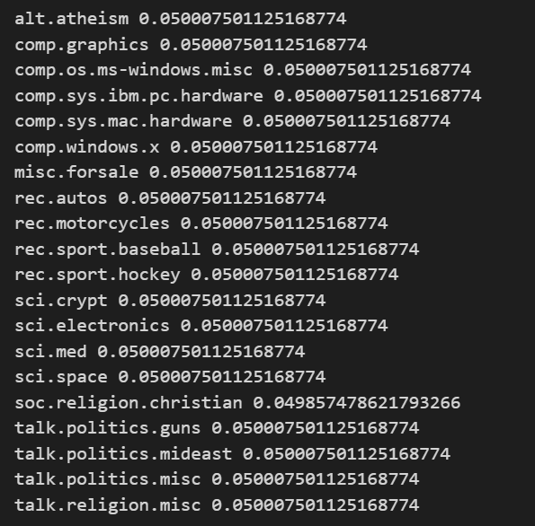
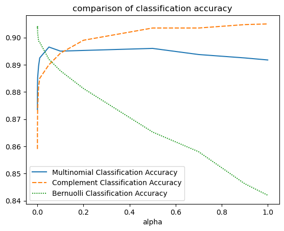
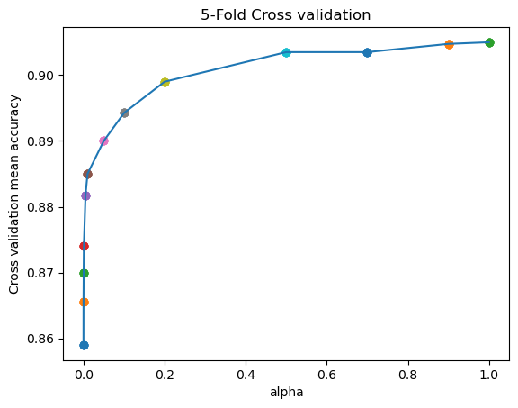

## **华东师范大学数据科学与工程学院实验报告** 

| **课程名称**：统计方法与机器学习      | **年级**：2022            | **实践成绩**：        |
| ------------------------------------- | ------------------------- | --------------------- |
| **指导教师**：董启文                  | **姓名**：郭夏辉          | **学号**：10211900416 |
| **上机实践编号**： Project 2 文本分类 | **上机实践时间**：2023.12 |                       |

## 实验目的

数据集：https://www.cs.cmu.edu/afs/cs.cmu.edu/project/theo-11/www/naive-bayes.html

- 任务：20000个文档分成20类，五折交叉验证结果，不要使用网站上的代码

- 源码+实验报告 交给助教 学期末考试前

## 实验过程

### 数据集初探

我从官网上下载到的数据集解压之后是文本，需要先处理成csv文件。



整理过后我发现自己的数据集只有19997行，并不是实验要求的20000行。经过反复尝试，我发现官网下载得到的数据就是19997行的，即19997个新闻。

数据集有3列，第一列是序号列；第二列是data，对应的新闻的文本内容；第三列是新闻所属的类别。

接下来我看了一下那20个类别：



### 朴素贝叶斯算法

朴素贝叶斯算法是一种基于贝叶斯定理的机器学习算法，它在文本分类任务和垃圾邮件（信息）检测任务。朴素贝叶斯最基本的假设即每个样本特征与其他的特征不相关，表示如下

$p(x|y)=p(x_1,x_2,...x_n|y)=p(x_1|y)p(x_2|y)...p(x_n|y)$

朴素贝叶斯算法实际上学习到生成数据的机制，所以朴素贝叶斯算法属于生成模型。

朴素贝叶斯法分类时，对给定的输入$x$, 通过学习到的模型计算后验概率分布$P(Y=c_k|X=x)$,将后验概率最大的类作为$x$的类输出,后验概率的计算如下所示：

$P(Y=c_k|X=x)=\frac{P(X=x|Y=c_k)P(Y=c_k)}{\sum{P(X=x|Y=c_k)P(Y=c_k)}}$

具体的朴素贝叶斯的算法流程如李航的《统计学习方法》所述，这里就不赘述了。

值得注意的是，我们需要在实验之前通过看每个类占总类别的百分比，看一下样本是否均衡的，这是代入到朴素贝叶斯模型的关键条件。可以看到总体是比较均衡：



各个类别所占比例近似于二十分之一

### 文本特征的提取

在正式分类之前，我将文本编码为了向量，采用的方法是TFIDF.因为TFIDF使用单词在句子中所占的比例来衡量其权重、编码单词。某个词越常见，编码后为它设置的权重就会越小，从而来防止频繁地出现的一些无意义的词。

### 三种不同分布的朴素贝叶斯模型

朴素贝叶斯估计的理论中，有对于概率分布的假设，包括Multinomial（多项式），Complement（补集），Bernuolli（二项分布），高斯分布等。

1. 多项式朴素贝叶斯适用于二项分布、多项分布，擅长分类型变量，多项式朴素贝叶斯的特征矩阵经常是稀疏矩阵，所以经常被用于文本分类；

2. 补集朴素贝叶斯是多项式朴素贝叶斯的改进，它能够解决样本不平衡的问题，并且能够一定程度上忽略朴素假设；
3. 二项分布朴素贝叶斯类似于多项式朴素贝叶斯，常用于处理文本分类数据，但由于二项分布朴素贝叶斯更在意存在与否，而不是出现多少次，这是两者的根本不同。

由于这里的矩阵比较稀疏，因此这里不宜使用高斯朴素贝叶斯。在不调整超参数时候来跑一下三种分布之下的朴素贝叶斯模型：

#### 多项式朴素贝叶斯

```
Multinomial
	Accuracy:0.887
                          precision    recall  f1-score   support

             alt.atheism       0.78      0.84      0.81       237
           comp.graphics       0.86      0.84      0.85       237
 comp.os.ms-windows.misc       0.94      0.87      0.91       271
comp.sys.ibm.pc.hardware       0.81      0.89      0.85       247
   comp.sys.mac.hardware       0.90      0.93      0.91       253
          comp.windows.x       0.94      0.89      0.92       237
            misc.forsale       0.93      0.79      0.86       247
               rec.autos       0.87      0.92      0.89       254
         rec.motorcycles       0.98      0.94      0.96       259
      rec.sport.baseball       0.96      0.94      0.95       244
        rec.sport.hockey       0.93      0.97      0.95       251
               sci.crypt       0.89      0.98      0.93       242
         sci.electronics       0.94      0.80      0.87       269
                 sci.med       1.00      0.89      0.94       256
               sci.space       0.93      0.96      0.94       262
  soc.religion.christian       0.87      1.00      0.93       260
      talk.politics.guns       0.83      0.94      0.88       253
   talk.politics.mideast       0.94      0.94      0.94       251
      talk.politics.misc       0.77      0.76      0.77       242
      talk.religion.misc       0.66      0.59      0.62       228

                accuracy                           0.89      5000
               macro avg       0.89      0.89      0.88      5000
            weighted avg       0.89      0.89      0.89      5000

00:00:390859
```

#### 补集朴素贝叶斯

```
Complement
	Accuracy:0.902
                          precision    recall  f1-score   support

             alt.atheism       0.77      0.83      0.80       237
           comp.graphics       0.86      0.86      0.86       237
 comp.os.ms-windows.misc       0.92      0.90      0.91       271
comp.sys.ibm.pc.hardware       0.86      0.83      0.84       247
   comp.sys.mac.hardware       0.93      0.91      0.92       253
          comp.windows.x       0.91      0.93      0.92       237
            misc.forsale       0.91      0.85      0.88       247
               rec.autos       0.91      0.94      0.92       254
         rec.motorcycles       0.97      0.99      0.98       259
      rec.sport.baseball       0.97      0.96      0.97       244
        rec.sport.hockey       0.93      0.99      0.96       251
               sci.crypt       0.97      0.99      0.98       242
         sci.electronics       0.93      0.91      0.92       269
                 sci.med       0.99      0.96      0.97       256
               sci.space       0.93      0.98      0.96       262
  soc.religion.christian       0.90      1.00      0.95       260
      talk.politics.guns       0.87      0.92      0.89       253
   talk.politics.mideast       0.91      0.97      0.94       251
      talk.politics.misc       0.83      0.75      0.79       242
      talk.religion.misc       0.68      0.52      0.59       228

                accuracy                           0.90      5000
               macro avg       0.90      0.90      0.90      5000
            weighted avg       0.90      0.90      0.90      5000

00:00:394772
```

#### 二项分布朴素贝叶斯

```
Bernuolli
	Accuracy:0.853
                          precision    recall  f1-score   support

             alt.atheism       0.76      0.81      0.78       237
           comp.graphics       0.68      0.96      0.80       237
 comp.os.ms-windows.misc       0.98      0.19      0.32       271
comp.sys.ibm.pc.hardware       0.79      0.96      0.87       247
   comp.sys.mac.hardware       0.95      0.98      0.96       253
          comp.windows.x       0.88      0.87      0.87       237
            misc.forsale       0.47      0.96      0.63       247
               rec.autos       0.96      0.91      0.94       254
         rec.motorcycles       1.00      0.95      0.97       259
      rec.sport.baseball       0.99      0.94      0.96       244
        rec.sport.hockey       1.00      0.93      0.96       251
               sci.crypt       0.96      0.93      0.94       242
         sci.electronics       0.92      0.95      0.93       269
                 sci.med       1.00      0.84      0.91       256
               sci.space       0.98      0.89      0.93       262
  soc.religion.christian       0.99      0.97      0.98       260
      talk.politics.guns       0.92      0.91      0.91       253
   talk.politics.mideast       0.94      0.80      0.87       251
      talk.politics.misc       0.81      0.71      0.76       242
      talk.religion.misc       0.66      0.62      0.64       228

                accuracy                           0.85      5000
               macro avg       0.88      0.85      0.85      5000
            weighted avg       0.89      0.85      0.85      5000

00:00:551102
```

可以看到，在目前还没有进行参数调整的情况下，补集朴素贝叶斯的Accuracy表现最好，但另外两种表现也不错。

此外我还统计了一下三者的训练时间，发现补集朴素贝叶斯时间最短，但是和多项式情况下差不多。

### 三种模型通过交叉验证来选择最优超参数

我选择的超参数是平滑系数alpha，这是朴素贝叶斯分类中拉普拉斯平滑过程的关键参数。alpha的取值范围：0.00001，0.0001，0.0005，0.001，0.005，0.01，0.05，0.1，0.2，0.5，0.7，0.9，1

我在本次实验采用的是5折交叉验证。把样本数据随机的分成4份，每次随机的选择4份作为训练集，剩下的1份做测试集。当这一轮完成后，重新随机选择4份来训练数据，最后进行模型评估。在改变alpha的过程中，我们应该选择平均准确率最高且方差较小的alpha。对于每一个alpha，计算验证集上的平均accuracy和standard deviation，选取accuracy较大且表现稳定的alpha。

主要是因为自己参数搜索的范围太大了，所以整个搜索过程花了一些时间。具体的交叉验证过程如代码所示，此处不赘述了。大致的参数与正确率曲线如下图所示：



由此可以看到，整体情况来说complement表现得要比Multinomial和Bernuolli要稳定且更好一些，接下来我用complement来看看最后的结果。

为了选择最优超参数，我也绘制了随着alpha的变化，交叉验证误差图。选取平均准确率最高且方差较小的alpha作为最后模型的参数：



在作图过程中，对于某alpha情况时得正确率，我计算其均值作为此时的accuracy.

## 实验结果与总结

最终达到91%的准确率，效果还行：

```
                          precision    recall  f1-score   support

             alt.atheism       0.77      0.81      0.79       173
           comp.graphics       0.88      0.86      0.87       179
 comp.os.ms-windows.misc       0.93      0.93      0.93       226
comp.sys.ibm.pc.hardware       0.91      0.83      0.87       204
   comp.sys.mac.hardware       0.93      0.93      0.93       205
          comp.windows.x       0.92      0.92      0.92       186
            misc.forsale       0.90      0.85      0.88       190
               rec.autos       0.90      0.96      0.93       203
         rec.motorcycles       0.98      1.00      0.99       218
      rec.sport.baseball       0.98      0.96      0.97       192
        rec.sport.hockey       0.93      0.99      0.96       203
               sci.crypt       0.97      0.99      0.98       200
         sci.electronics       0.93      0.92      0.92       227
                 sci.med       0.98      0.97      0.98       196
               sci.space       0.93      0.99      0.96       205
  soc.religion.christian       0.90      1.00      0.95       215
      talk.politics.guns       0.87      0.90      0.89       205
   talk.politics.mideast       0.91      0.98      0.94       197
      talk.politics.misc       0.82      0.71      0.76       200
      talk.religion.misc       0.64      0.51      0.57       176

                accuracy                           0.91      4000
               macro avg       0.90      0.90      0.90      4000
            weighted avg       0.90      0.91      0.90      4000
```

本次实验中，我采用了三种不同分布假设下的朴素贝叶斯模型来解决文本分类问题。辅以TFIDF文本特征提取，五折交叉验证等方法，对比并分析了三种模型，并且结合超参数调整找到了最优的超参数，最后达到了92%的正确率，取得了还不错的分类效果。虽然在本次实验中Complement分布的表现最佳，但这个需要结合具体的数据集来讨论，不能一概而论。
