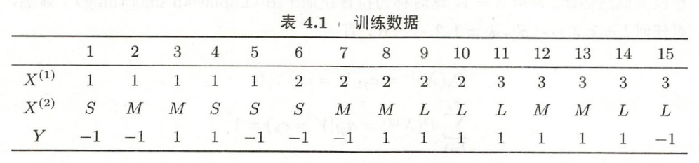

## 机器学习理论作业2

10211900416 郭夏辉

**Q: 针对表4.1(P63)的数据，采用拉普拉斯平滑建立贝叶斯分类器，并求点x=$(3,S)^{T} $ 的类标记**

取$λ=1$,由于$P_λ(Y=c_k)=\frac{\sum_{i=1}^{N}I(y_i=c_k)+λ}{N+Kλ}$，故带入可得：

 $P(Y=1) = \frac {10}{17} $ , $P(Y=-1) = \frac {7}{17} $ 

 $P(X^{(1)}=1|Y=1)= \frac {3}{12} $,$P(X^{(1)}=2|Y=1)= \frac {4}{12} $  ,$P(X^{(1)}=3|Y=1)= \frac {5}{12} $

 $P(X^{(2)}=S|Y=1)= \frac {2}{12} $,$P(X^{(2)}=M|Y=1)= \frac {5}{12} $  ,$P(X^{(2)}=L|Y=1)= \frac {5}{12} $

 $P(X^{(1)}=1|Y=-1)= \frac {4}{9} $,$P(X^{(1)}=2|Y=-1)= \frac {3}{9} $  ,$P(X^{(1)}=3|Y=-1)= \frac {2}{9} $

 $P(X^{(2)}=S|Y=-1)= \frac {4}{9} $,$P(X^{(2)}=M|Y=-1)= \frac {3}{9} $  ,$P(X^{(2)}=L|Y=-1)= \frac {2}{9} $

x=$(3,S)^{T}$ 时，现在要求$y=argmax_{c_k} P(Y=c_k) {\prod}_{j}P(X^{(j)}=x^{(j)}|Y=c_k)  $

$P(Y=1)P(X^{(1)}=3|Y=1)P(X^{(2)}=S|Y=1)=\frac{100}{2448}=0.0408$

$P(Y=-1)P(X^{(1)}=3|Y=-1)P(X^{(2)}=S|Y=-1)=\frac{56}{1377}=0.0407$

由于$0.0408>0.0407$,故$y=1$

